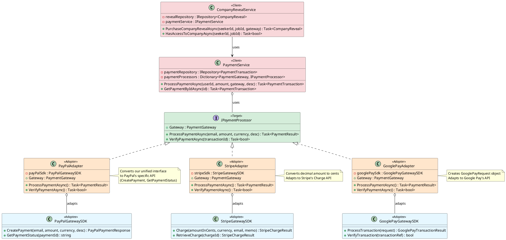
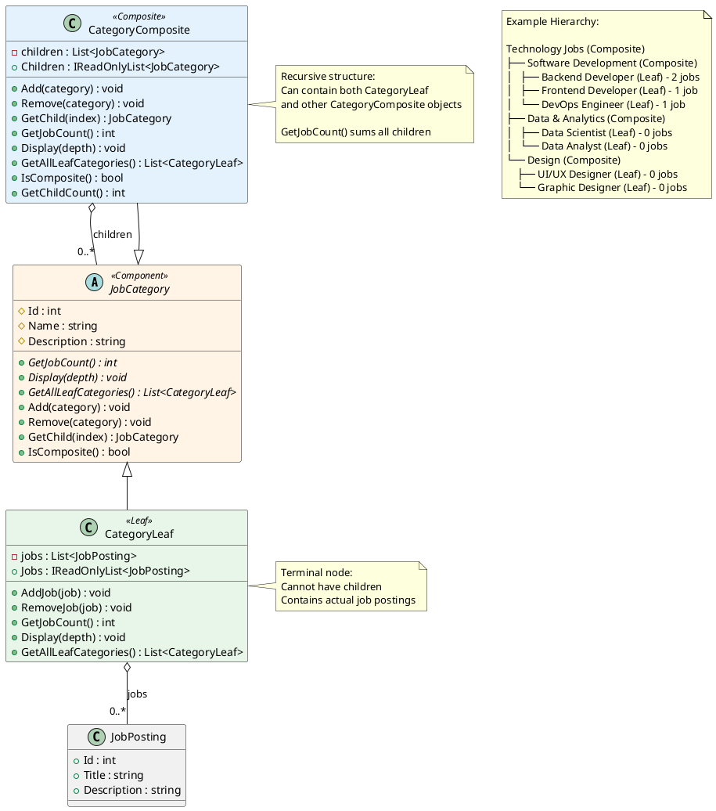
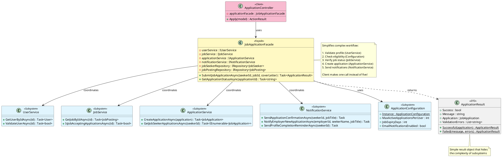
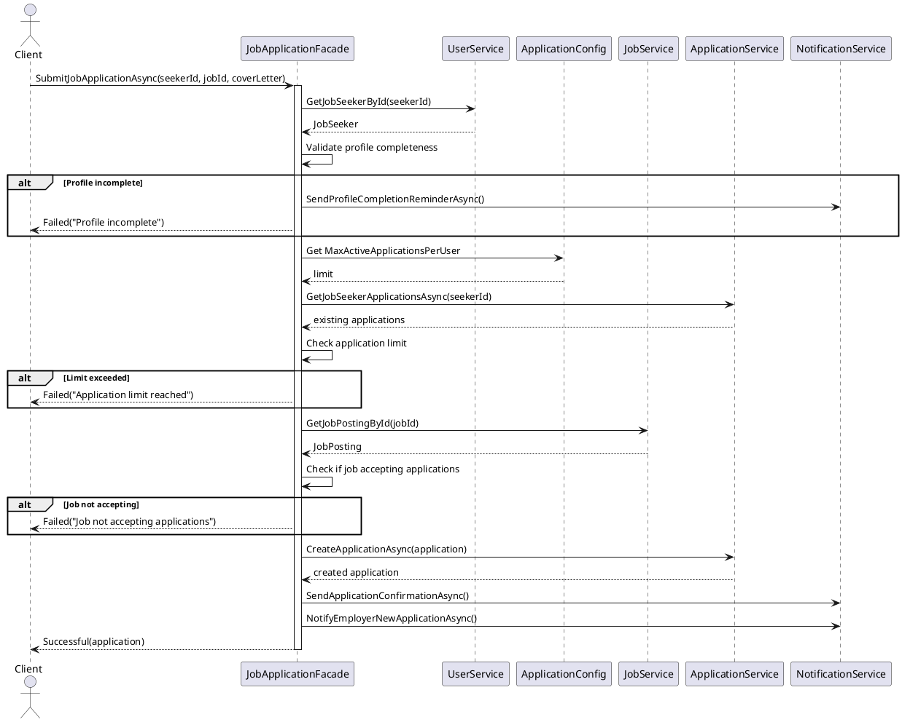

you# Design Patterns - Lab 4: Structural Patterns

## Overview
This document demonstrates the implementation of three structural design patterns in the OnlineJobs platform:
1. **Adapter Pattern** - Payment Gateway Integration
2. **Composite Pattern** - Job Category Hierarchy
3. **Façade Pattern** - Job Application Workflow Simplification

---

## 1. Adapter Pattern - Payment Gateway Integration

### Purpose
The Adapter pattern allows incompatible interfaces to work together. In this implementation, we integrate multiple payment gateways (PayPal, Stripe, Google Pay) with different APIs through a unified interface.

### Business Scenario
Job seekers can pay to reveal which company posted a job listing. This feature allows:
- Anonymous job postings where the company name is hidden
- Job seekers pay $4.99 to unlock company information
- Payment through multiple gateways (PayPal, Stripe, Google Pay)
- Each gateway has a different API that needs to be adapted

### Components

#### Target Interface (`IPaymentProcessor`)
```csharp
public interface IPaymentProcessor
{
    PaymentGateway Gateway { get; }
    Task<PaymentResult> ProcessPaymentAsync(string userEmail, decimal amount, string currency, string description);
    Task<bool> VerifyPaymentAsync(string transactionId);
}
```

#### Adaptees (External Gateway SDKs)
- **PayPalGatewaySDK** - Uses `CreatePayment()`, returns `PayPalPaymentResponse`
- **StripeGatewaySDK** - Uses `Charge()` with amount in cents, returns `StripeChargeResult`
- **GooglePayGatewaySDK** - Uses `ProcessTransaction()` with request object, returns `GooglePayTransactionResult`

#### Adapters
- **PayPalAdapter** - Adapts PayPal SDK to `IPaymentProcessor`
- **StripeAdapter** - Adapts Stripe SDK to `IPaymentProcessor` (converts decimal to cents)
- **GooglePayAdapter** - Adapts Google Pay SDK to `IPaymentProcessor` (uses request object)

#### Services
- **PaymentService** - Orchestrates payment processing using adapters
- **CompanyRevealService** - Business logic for revealing company information

### Class Diagram



### Benefits
- **Single Responsibility**: Each adapter handles one gateway
- **Open/Closed**: New payment gateways can be added without modifying existing code
- **Unified Interface**: Client code works with all gateways uniformly
- **Interchangeability**: Payment gateways can be swapped easily

---

## 2. Composite Pattern - Job Category Hierarchy

### Purpose
The Composite pattern allows you to compose objects into tree structures to represent part-whole hierarchies. It lets clients treat individual objects and compositions uniformly.

### Business Scenario
Job postings are organized in a hierarchical category system:
- **Root**: "Technology Jobs" (composite)
- **Branches**: "Software Development", "Data & Analytics", "Design" (composites)
- **Leaves**: "Backend Developer", "Frontend Developer", "Data Scientist" (leafs)

### Components

#### Component (Abstract Base)
```csharp
public abstract class JobCategory
{
    public abstract int GetJobCount();
    public abstract void Display(int depth = 0);
    public abstract List<CategoryLeaf> GetAllLeafCategories();
    public virtual void Add(JobCategory category) { throw new NotSupportedException(); }
    public virtual void Remove(JobCategory category) { throw new NotSupportedException(); }
    public virtual JobCategory GetChild(int index) { throw new NotSupportedException(); }
}
```

#### Leaf
```csharp
public class CategoryLeaf : JobCategory
{
    private readonly List<JobPosting> _jobs;
    // Contains actual job postings
    // Cannot have children
}
```

#### Composite
```csharp
public class CategoryComposite : JobCategory
{
    private readonly List<JobCategory> _children;
    // Can contain both leafs and other composites
    // Delegates operations to children
}
```

### Class Diagram



### Benefits
- **Uniform Treatment**: Treat individual categories and category groups uniformly
- **Recursive Composition**: Build complex hierarchies from simple components
- **Easy Traversal**: Navigate tree structure easily
- **Aggregation**: Calculate totals (job counts) across hierarchy

---

## 3. Façade Pattern - Job Application Workflow

### Purpose
The Façade pattern provides a simplified interface to a complex subsystem. It hides the complexity of multiple services and coordinates their interactions.

### Business Scenario
Submitting a job application involves multiple complex steps:
1. Validate job seeker profile completeness
2. Check eligibility (application limits, account status)
3. Verify job posting is accepting applications
4. Create application record
5. Send notifications to both parties

The Façade simplifies this to one method call: `SubmitJobApplicationAsync()`

### Components

#### Façade
```csharp
public class JobApplicationFacade
{
    private readonly IUserService _userService;
    private readonly IJobService _jobService;
    private readonly IApplicationService _applicationService;
    private readonly INotificationService _notificationService;

    public Task<ApplicationResult> SubmitJobApplicationAsync(
        int jobSeekerId,
        int jobPostingId,
        string coverLetter)
    {
        // Coordinates all subsystems in the correct order
        // Returns simple success/failure result
    }
}
```

#### Subsystems
- **UserService** - Profile validation
- **JobService** - Job posting validation
- **ApplicationService** - Application creation
- **NotificationService** - Email/notifications
- **ApplicationConfiguration** - Business rules (Singleton from Lab 3)

### Class Diagram



### Workflow Diagram



### Benefits
- **Simplified Interface**: One method instead of coordinating five services
- **Decoupling**: Client doesn't need to know about subsystem complexity
- **Centralized Logic**: Workflow logic in one place
- **Easy Testing**: Mock the façade instead of all subsystems

---

## 4. Summary of Lab 4 Structural Patterns

### Pattern Comparison

| Pattern | Purpose | Use Case | Key Benefit |
|---------|---------|----------|-------------|
| **Adapter** | Convert incompatible interfaces | Payment gateway integration | Interoperability |
| **Composite** | Compose objects into tree structures | Job category hierarchy | Uniform treatment |
| **Façade** | Provide simplified interface to complex subsystem | Job application workflow | Simplification |

### Implementation Statistics

- **Files Created**: 23 new files
- **Patterns Implemented**: 3 structural patterns
- **Adapters**: 3 payment gateway adapters
- **Category Types**: 2 (Leaf, Composite)
- **Subsystems Coordinated**: 5 (UserService, JobService, ApplicationService, NotificationService, Configuration)

### Architecture Integration

All three structural patterns integrate seamlessly with the existing Clean Architecture:

```
Domain Layer
├── Entities: PaymentTransaction, CompanyReveal, JobCategory, CategoryLeaf, CategoryComposite
├── Enums: PaymentStatus, PaymentGateway
└── Interfaces: IPrototype (Lab 3)

Application Layer
├── Adapters: PayPalAdapter, StripeAdapter, GooglePayAdapter (Lab 4)
├── ExternalGateways: PayPalSDK, StripeSDK, GooglePaySDK (Lab 4)
├── Facades: JobApplicationFacade (Lab 4)
├── Services: PaymentService, CompanyRevealService, NotificationService (Lab 4)
├── Builders: JobSeekerProfileBuilder (Lab 3)
├── Configuration: ApplicationConfiguration (Lab 3 - Singleton)
└── DTOs: ApplicationResult (Lab 4)

Infrastructure Layer
├── Repositories: InMemoryRepository<T> (Generic Repository Pattern)

Presentation Layer
├── Controllers: (Can use Façade for simplified interactions)
```

### Running the Demo

To see all three patterns in action:

1. Run the application: `dotnet run`
2. Observe console output showing:
   - **Composite Pattern**: Category hierarchy with job counts
   - **Adapter Pattern**: Payments processed through 3 different gateways
   - **Façade Pattern**: Simplified application workflow with validation

### Key Takeaways

1. **Adapter Pattern** solved the problem of integrating incompatible third-party APIs
2. **Composite Pattern** enabled hierarchical organization with uniform operations
3. **Façade Pattern** simplified complex multi-service workflows into single method calls
4. All patterns maintain SOLID principles and clean architecture
5. Patterns work together: Façade uses services that might use Adapters internally

---

*This implementation demonstrates professional-grade structural pattern usage in a real-world ASP.NET Core application.*