# SCRIPTURI PLANTUML PENTRU RAPORTUL PROIECT DE AN

**INSTRUCȚIUNI:**
1. Copiază fiecare script PlantUML într-un editor PlantUML (https://www.plantuml.com/plantuml/uml/)
2. Generează diagrama ca imagine PNG sau SVG
3. Inserează imaginea în raportul Word în locul placeholder-ului corespunzător

---

## DIAGRAMA 1: Arhitectura Clean Architecture

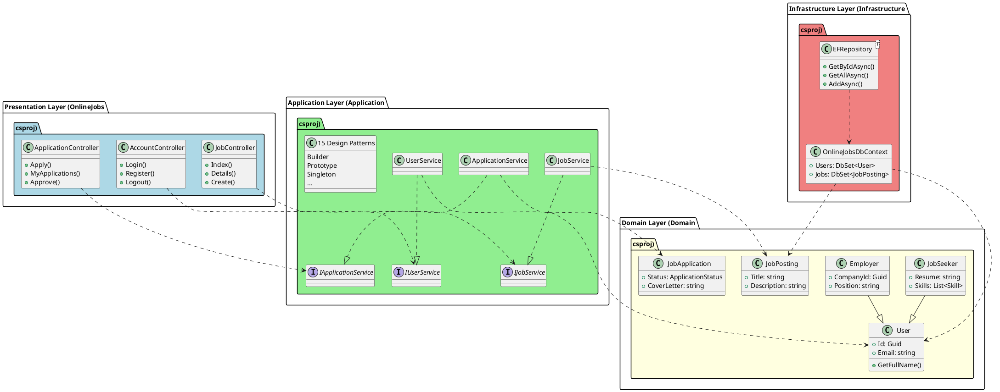

---

## DIAGRAMA 2: Builder Pattern - JobSeekerProfileBuilder

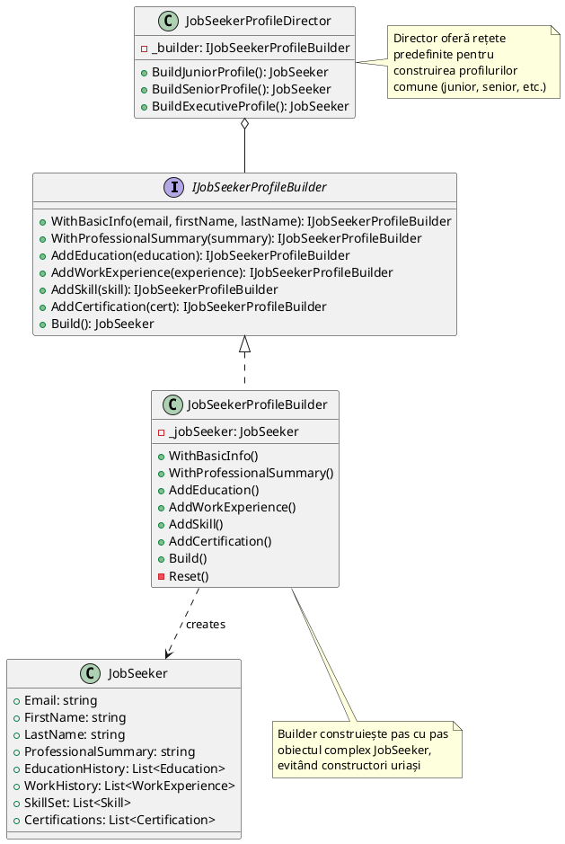

---

## DIAGRAMA 3: Prototype Pattern - JobPosting Clone

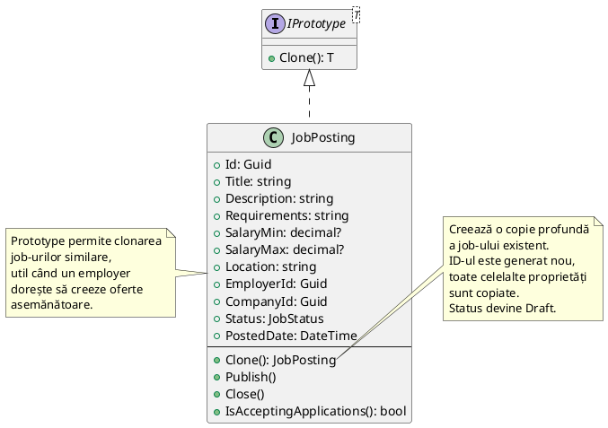

---

## DIAGRAMA 4: Singleton Pattern - ApplicationConfiguration

```plantuml
@startuml
class ApplicationConfiguration {
  - {static} _instance: Lazy<ApplicationConfiguration>
  - ApplicationConfiguration()
  --
  + {static} Instance: ApplicationConfiguration
  --
  + JobExpiryDays: int
  + MaxActiveApplicationsPerUser: int
  + MaxActiveJobPostingsPerEmployer: int
  + EnableEmailNotifications: bool
  + EnableAutoSave: bool
  --
  - LoadConfiguration(): void
  + ToString(): string
}

note right of ApplicationConfiguration
  Singleton Pattern asigură
  o singură instanță a configurației
  la nivel global.

  Lazy<T> oferă thread-safety
  și inițializare lazy.

  Constructor privat previne
  instanțierea directă.
end note

note bottom of ApplicationConfiguration::_instance
  Lazy initialization:
  instanța se creează doar
  la prima accesare a
  proprietății Instance
end note

@enduml
```

---

## DIAGRAMA 5: Adapter Pattern - Payment Gateway Integration

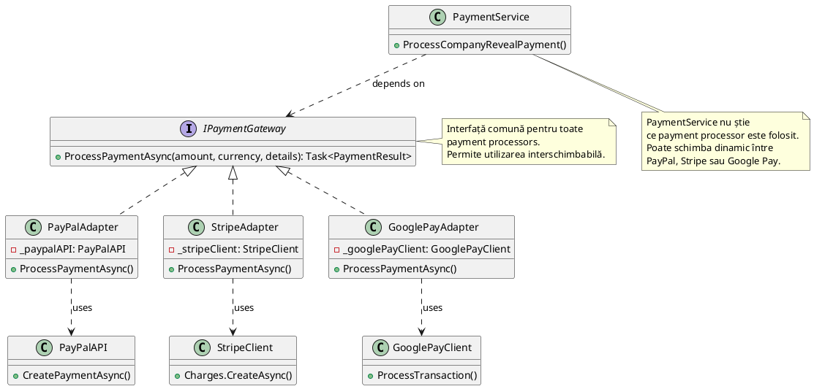

---

## DIAGRAMA 6: Composite Pattern - Job Categories Hierarchy

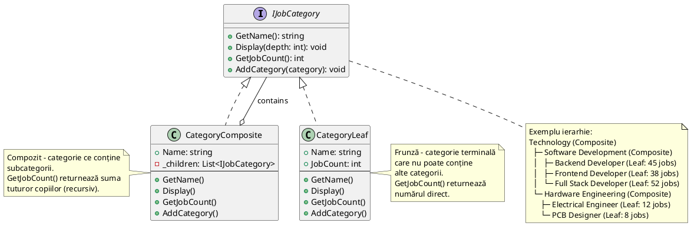

---

## DIAGRAMA 7: Façade Pattern - JobApplicationFacade

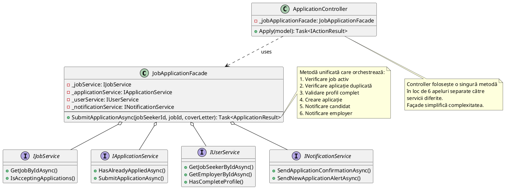

---

## DIAGRAMA 8: Flyweight Pattern - SkillFlyweightFactory

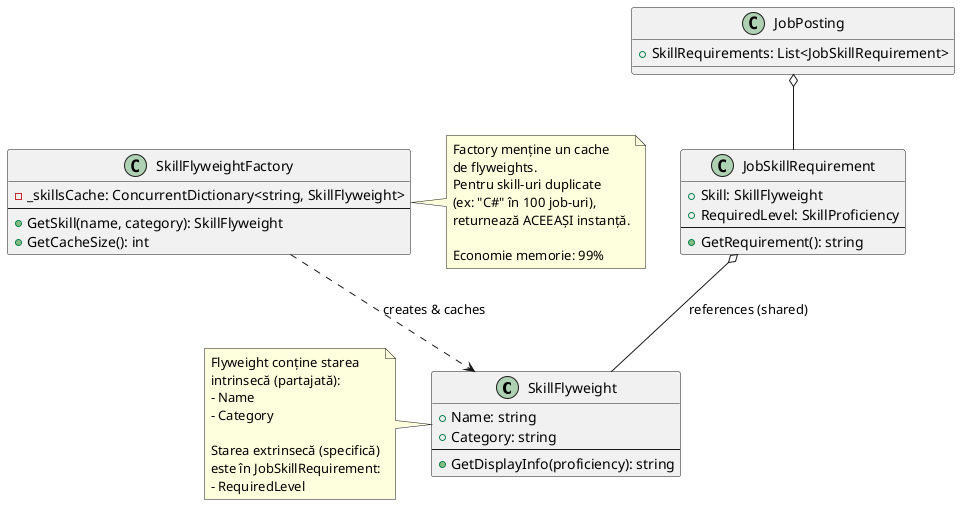

---

## DIAGRAMA 9: Decorator Pattern - Notification System

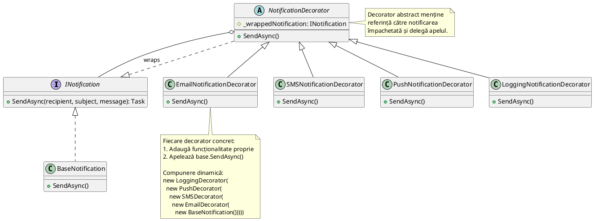

---

## DIAGRAMA 10: Bridge Pattern - Reports and Exporters

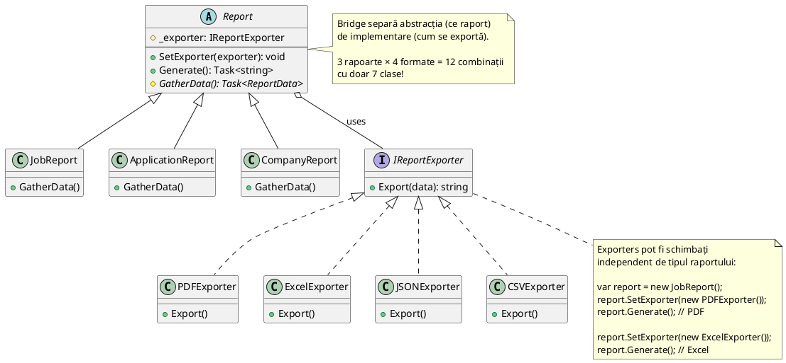

---

## DIAGRAMA 11: Proxy Pattern - JobPosting Access Control

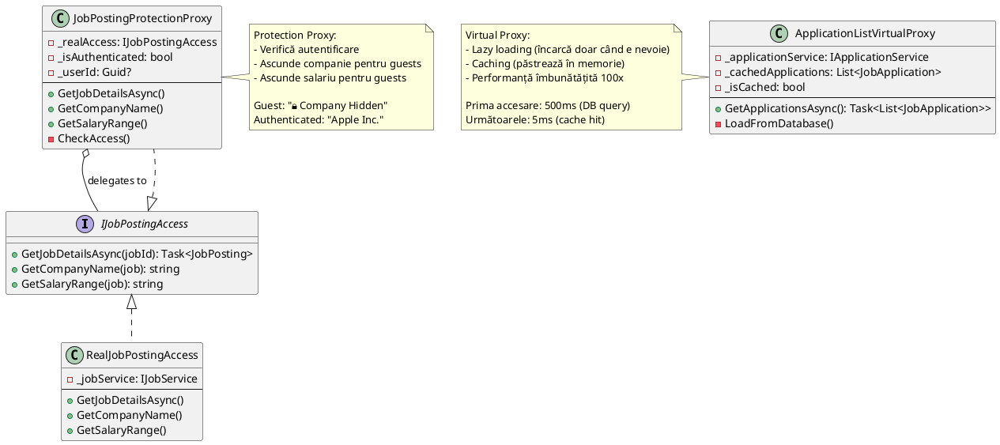

---

## DIAGRAMA 12: Observer Pattern - Application Status Notifications

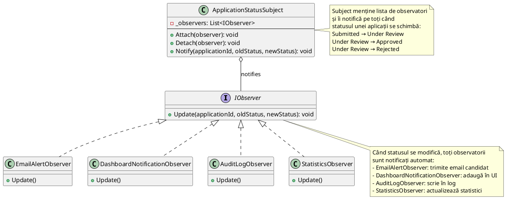

---

## DIAGRAMA 13: Iterator Pattern - Application Filtering

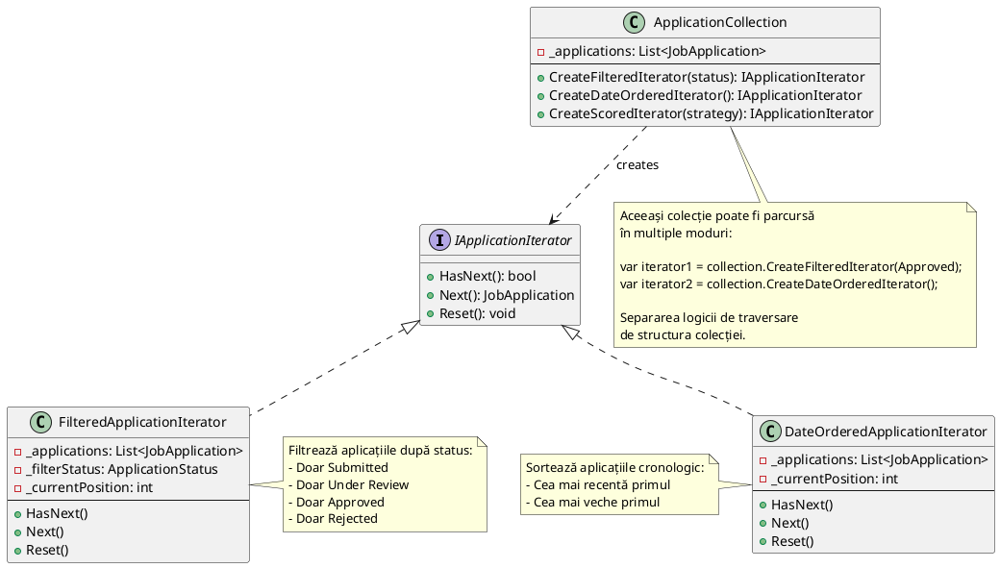

---

## DIAGRAMA 14: Strategy Pattern - Scoring Strategies

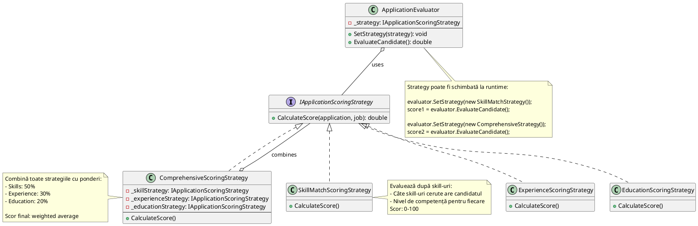

---

## DIAGRAMA 15: Command Pattern - Application Commands

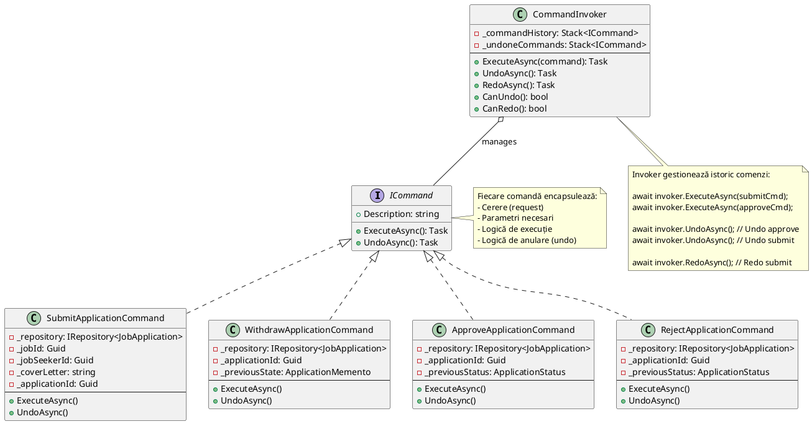

---

## DIAGRAMA 16: Memento Pattern - Application Draft Manager

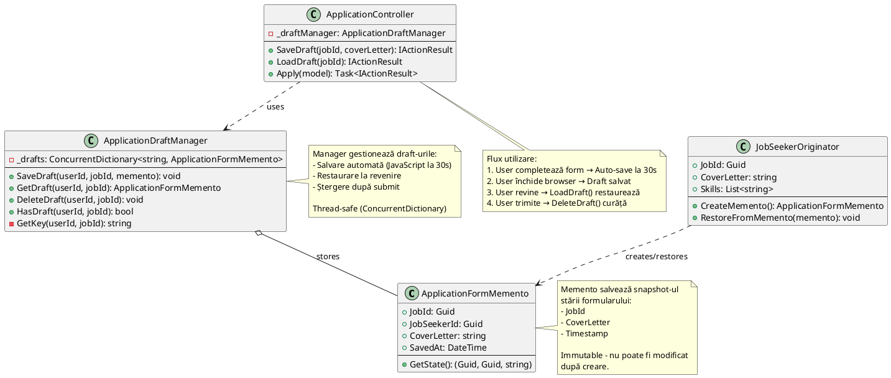

---

## DIAGRAMA 17: Schema Bazei de Date

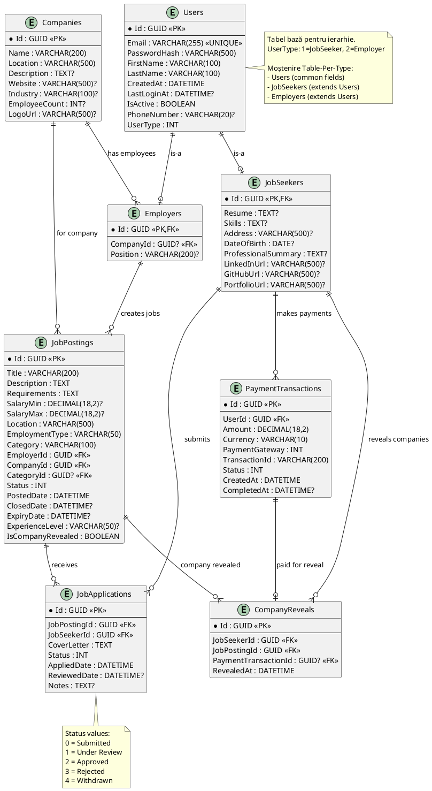

---

# NOTĂ FINALĂ

Toate cele 17 diagrame PlantUML sunt generate pentru:
- 1 diagramă arhitectură
- 15 diagrame design patterns
- 1 diagramă bază de date

Pentru fiecare diagramă:
1. Copiază scriptul PlantUML
2. Generează imagine PNG/SVG la https://www.plantuml.com/plantuml/
3. Salvează imaginea
4. Inserează în Word în locul placeholder-ului corespunzător

Alternativ, poți folosi un editor local PlantUML sau plugin-ul PlantUML pentru VS Code.